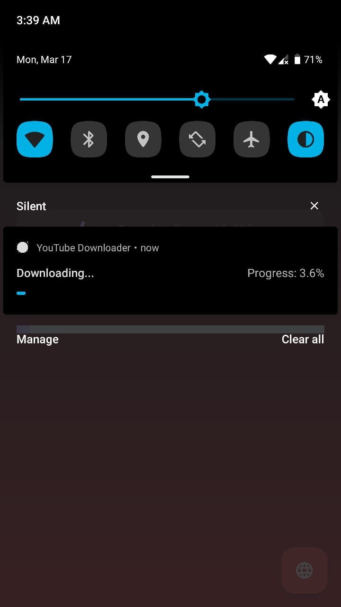

# YT Downloader

<p align="center">
  
</p>

A modern Flutter application for downloading YouTube videos in various formats. Built with material design principles and supports both English and Arabic languages.

[](LICENSE)
[](https://flutter.dev)
[](https://android.com)

## ✨ Features

- 📱 Modern material design interface
- 🎥 Download videos in multiple qualities
- 🔊 Extract audio as MP3
- 🌐 Bilingual support (English/Arabic)
- 📊 Real-time download progress
- 📨 Share directly from YouTube app
- 📁 Built-in file management
- 🔔 Download notifications

## 📸 Screenshots

<p align="center">
  
  &nbsp;&nbsp;
  
  &nbsp;&nbsp;
  
</p>

## 🚀 Getting Started

### Prerequisites

- Flutter SDK (3.x or higher)
- Android Studio / VS Code
- Android device or emulator (Android 6.0 or higher)
- YouTube API key (optional)

### Installation

1. Clone the repository

```bash
git clone https://github.com/kirolos-esmat/Youtube_Downloader.git
```

2. Get dependencies

```bash
flutter pub get
```

3. Run the app

```bash
flutter run
```

## 🛠 Built With

- [Flutter](https://flutter.dev/) - UI Framework
- [youtube_explode_dart](https://pub.dev/packages/youtube_explode_dart) - YouTube API Interface
- [ffmpeg_kit_flutter](https://pub.dev/packages/ffmpeg_kit_flutter) - Media Processing
- [permission_handler](https://pub.dev/packages/permission_handler) - Permission Management
- [flutter_local_notifications](https://pub.dev/packages/flutter_local_notifications) - Notifications

## 🤝 Contributing

We welcome contributions! Please see our [Contributing Guide](CONTRIBUTING.md) for details.

1. Fork the Project
2. Create your Feature Branch (`git checkout -b feature/AmazingFeature`)
3. Commit your Changes (`git commit -m 'Add some AmazingFeature'`)
4. Push to the Branch (`git push origin feature/AmazingFeature`)
5. Open a Pull Request

## 📝 License

This project is licensed under the Apache License, Version 2.0 - see the [LICENSE](LICENSE) file for details.

## 🙏 Acknowledgments

- Thanks to all the package authors and contributors
- Inspired by various YouTube downloaders

## ⚠️ Disclaimer

This app is for personal use only. Please respect YouTube's terms of service and content creators' rights.
